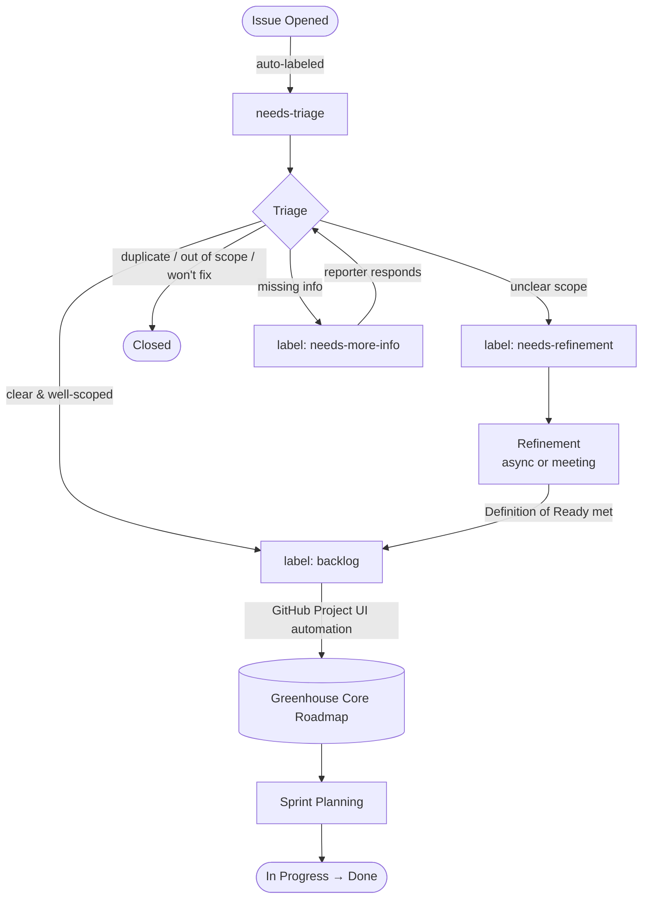

# Contributing

## Code of Conduct

All members of the project community must abide by the [SAP Open Source Code of Conduct](https://github.com/SAP/.github/blob/main/CODE_OF_CONDUCT.md).
Only by respecting each other we can develop a productive, collaborative community.
Instances of abusive, harassing, or otherwise unacceptable behavior may be reported by contacting [a project maintainer](.reuse/dep5).

## Engaging in Our Project

We use GitHub to manage reviews of pull requests.

* If you are a new contributor, see: [Steps to Contribute](#steps-to-contribute)

* Before implementing your change, create an issue that describes the problem you would like to solve or the code that should be enhanced. Please note that you are willing to work on that issue.

* The team will review the issue and decide whether it should be implemented as a pull request. In that case, they will assign the issue to you. If the team decides against picking up the issue, the team will post a comment with an explanation.

## Steps to Contribute

Should you wish to work on an issue, please claim it first by commenting on the GitHub issue that you want to work on. This is to prevent duplicated efforts from other contributors on the same issue.

If you have questions about one of the issues, please comment on them, and one of the maintainers will clarify.

## Contributing Code or Documentation

You are welcome to contribute code in order to fix a bug or to implement a new feature that is logged as an issue.

The following rule governs code contributions:

* Contributions must be licensed under the [Apache 2.0 License](./LICENSE)
* Due to legal reasons, contributors will be asked to accept a Developer Certificate of Origin (DCO) when they create the first pull request to this project. This happens in an automated fashion during the submission process. SAP uses [the standard DCO text of the Linux Foundation](https://developercertificate.org/).

## Opening a Pull Request

We are enforcing that the PR title follows [conventional commits](https://www.conventionalcommits.org/en/v1.0.0/). During the release the changelog will be generated based on the commit history.

That means that the PR title should be in the format of `<type>(<scope>): <description>`. For example: `fix(teamrolebindings): issue with updating status`.

A full list of accepted types and scopes can be found [here](https://github.com/cloudoperators/greenhouse/blob/main/.github/workflows/ci-pr-title.yaml) in the GitHub Action configuration.

Before opening a Pull Request, make sure:

* There is an open issue related to the change, and this issue was accepted by a maintainer.
* Your code is compliant with the [Go Code Review Comments](https://go.dev/wiki/CodeReviewComments)
* Tests for the changes are included.
* `make test` passes successfully.

## Issues and Planning

We use GitHub issues to track bugs and enhancement requests.

Please provide as much context as possible when you open an issue. The information you provide must be comprehensive enough to reproduce that issue for the assignee.

### Issue Lifecycle

Every issue follows this workflow from creation to delivery:

#### Stage Details

**1. Issue Opened → `needs-triage`**

Every new issue is automatically labeled `needs-triage` by the [`issue-triage.yml`](.github/workflows/issue-triage.yml) workflow. No manual action is required from the reporter.

**2. Triage** (target: within 5 business days)

A maintainer removes `needs-triage` and takes one of these actions:

| Outcome | Action |
|---|---|
| Clear and well-scoped | Add label **`backlog`** — issue is auto-added to the Roadmap |
| Unclear scope | Add label **`needs-refinement`** |
| Needs more info | Add label **`needs-more-info`** and comment |
| Duplicate / out of scope / won't fix | Close with a short explanation comment |

**3. Refinement → `backlog`**

Issues labeled `needs-refinement` are discussed asynchronously in comments or during a refinement meeting. An issue is ready for the backlog when it has:

* A clear problem statement
* Testable acceptance criteria
* A size estimate (`size/S`, `size/M`, `size/L`, `size/XL`)
* Dependencies identified

Once ready, the maintainer removes `needs-refinement` and applies `backlog`.

**4. Backlog → Sprint**

During Sprint Planning, maintainers pull issues from the backlog into the upcoming sprint and assign them to a milestone.

### Label Reference

| Label | Applied by | Meaning |
|---|---|---|
| `needs-triage` | Automation (on open) | New issue, not yet reviewed |
| `needs-refinement` | Maintainer | Needs scoping before entering backlog |
| `needs-more-info` | Maintainer | Waiting on reporter for details |
| `backlog` | Maintainer | Ready for sprint planning; triggers Roadmap project automation |
| `bug` | Issue template | Regression or unintended behavior |
| `feature` | Issue template | New capability request |
| `size/S` | Maintainer | < 1 day |
| `size/M` | Maintainer | 1–3 days |
| `size/L` | Maintainer | 3–5 days |
| `size/XL` | Maintainer | > 5 days; consider splitting |

> **Quick links:**
> Issues needing triage: [`needs-triage`](https://github.com/cloudoperators/greenhouse/issues?q=is%3Aopen+is%3Aissue+label%3Aneeds-triage)
> Issues ready to pick up: [`backlog`](https://github.com/cloudoperators/greenhouse/issues?q=is%3Aopen+is%3Aissue+label%3Abacklog)
