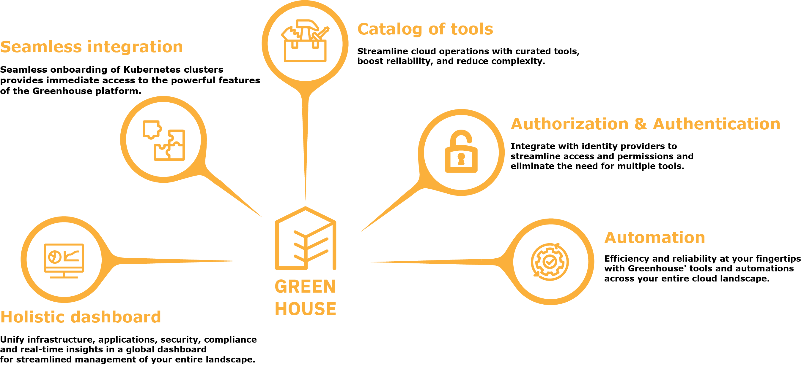

Greenhouse
==========

Greenhouse is a cloud operations platform designed to streamline and simplify the management of a large-scale, distributed infrastructure.

It offers a unified interface for organizations to manage various operational aspects efficiently and transparently and operate their cloud infrastructure in compliance with industry standards.
The platform addresses common challenges such as the fragmentation of tools, visibility of application-specific permission concepts and the management of organizational groups.
It also emphasizes the harmonization and standardization of authorization concepts to enhance security and scalability.
With its operator-friendly dashboard, features and extensive automation capabilities, Greenhouse empowers organizations to optimize their cloud operations, reduce manual efforts, and achieve greater operational efficiency.

## Value propositions

## Community

Greenhouse holds bi-weekly community calls in Microsoft Teams.

## Roadmap

The [Roadmap Kanban board](https://github.com/orgs/cloudoperators/projects/1) provides an overview of ongoing and planned efforts.

## Documentation

User guides, links and references are available in the official [Greenhouse documentation](https://cloudoperators.github.io/greenhouse/).

### Architecture & Design

The [Greenhouse design and architecture document](https://cloudoperators.github.io/greenhouse/docs/architecture/product_design/) describes the various use-cases and user stories.

### API resources

Greenhouse extends Kubernetes using Custom Resource Definitions(CRD).
See the [API resources documentation](https://cloudoperators.github.io/greenhouse/docs/reference/api/) for more details.

## Code of Conduct

We as members, contributors, and leaders pledge to make participation in our community a harassment-free experience for everyone. By participating in this project, you agree to abide by its [Code of Conduct](https://github.com/SAP/.github/blob/main/CODE_OF_CONDUCT.md) at all times.

## Licensing

Copyright 2024 SAP SE or an SAP affiliate company and Greenhouse contributors. Please see our [LICENSE](LICENSE) for copyright and license information. Detailed information including third-party components and their licensing/copyright information is available [via the REUSE tool](https://api.reuse.software/info/github.com/cloudoperators/greenhouse).
