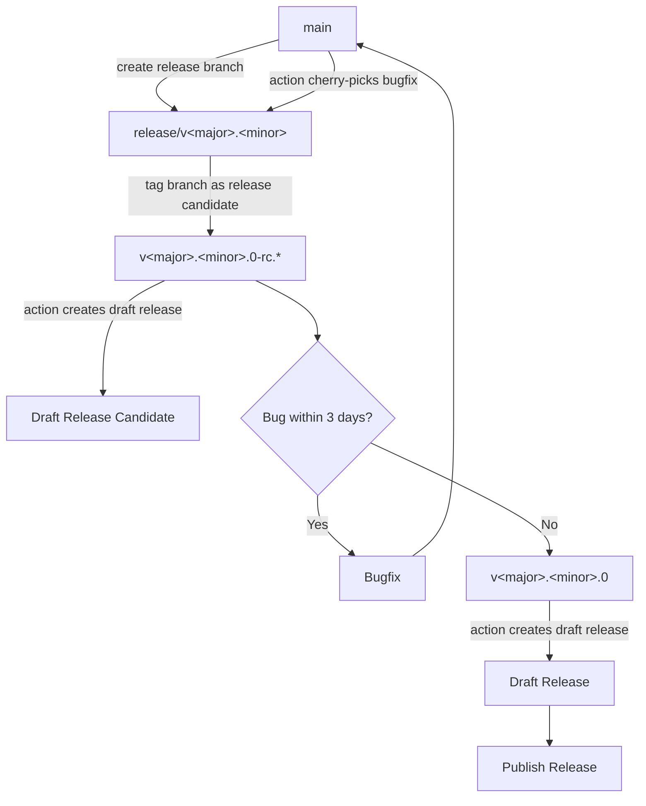

# Releasing Greenhouse

This page describes the release cadence and process for the Greenhouse project.

We are following [Semantic Versioning](https://semver.org) for versioning.

> [!WARNING]
> Semantic Versioning [states](https://semver.org/spec/v2.0.0.html#spec-item-4) major version zero (0.y.z) should not be considered stable and may change at any time.

## Release Cadence

We intend for regular releases every four weeks. The release should happen in the week after the end of each sprint. For the current sprint schedule please have a look at the [roadmap project](https://github.com/orgs/cloudoperators/projects/9).

Bug fixes may be released at any time, but we will try to bundle them into the next release.

In general no feature should block a release and the `main` branch should always be stable.

Each minor release will be overseen by a release shepherd.
The responsibility of the release shepherd is to perform the release and to communicate the release to the community.

## Release Process

This is the process for releasing a new minor version of Greenhouse:

### How to tag a new release version

At the end of the sprint, the release shepherd should create a new release branch from `main`. The release branch should be named `release/v<major>.<minor>`.

1. Create a new release branch from `main` (`git checkout release-v<MAJOR.MINOR>`)
2. Push the release branch to the repository
3. Tag the release branch with the release candidate version tag `v<major>.<minor>.0-rc.0` (`git tag v<major>.<minor>.0-rc.0`)

### How to release a new version

After pushing the release tag, there a GitHub Action is triggered to create a new draft release for the given tag. This draft release will contain the changelog and the release assets.

The release shepherd should

- review the changelog (note any breaking changes or highlight new features)
- check uploaded release assets (`greenhousectl` binaries)
- ensure the helm-charts, docker images with the release tag are uploaded to GitHub Container Registry
- add a link to the changelog since the last Greenhouse Dashboard release
- ensure the release is marked as pre-release for `rc` releases.

Once everything is in order, the release shepherd can publish the release.

In case there are bugs found for a release candidate see the [Bugfixes](#bugfixes) section on how to get fixes into the release branch.

Once the release candidate is stable, the release shepherd can create a new release tag `v<major>.<minor>.0` on the release branch and push it to the repository. A GitHub Action will run and create a new draft release for the given tag. The release shepherd should review the changelog and note any breaking changes or highlight new features. After the release notes are reviewed the release shepherd can publish the release.

### Bugfixes

Any bugs found (either during the release candidate period or after) need to be fixed on the main branch and cherry-picked to the release branch.
A bugfix can be cherry-picked onto the release branch by commenting on the PR with `/cherry-pick release-v<major>.<minor>`. This will trigger a GitHub Action that will create a new PR on the release branch with the cherry-picked commit.
