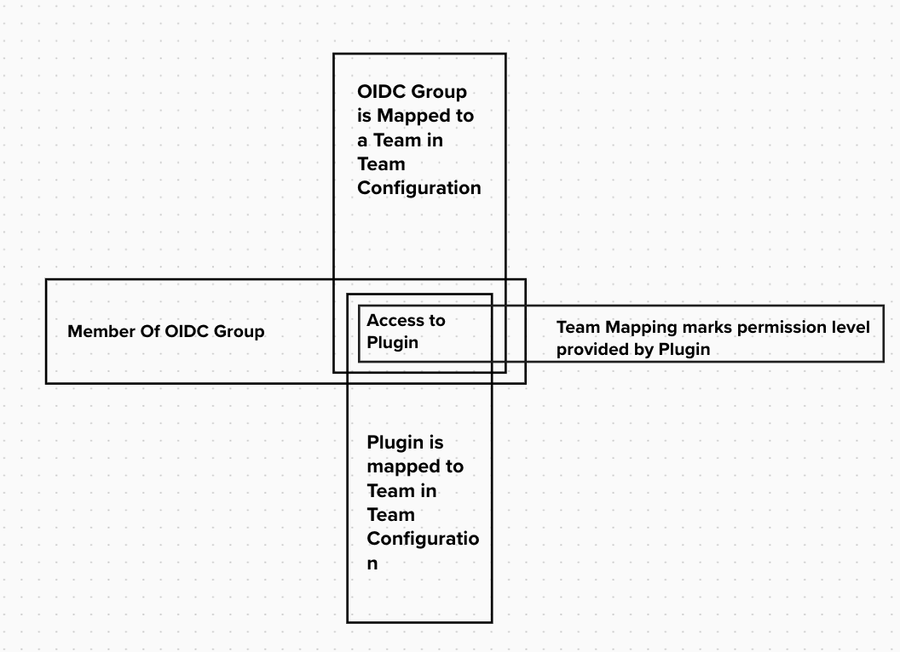
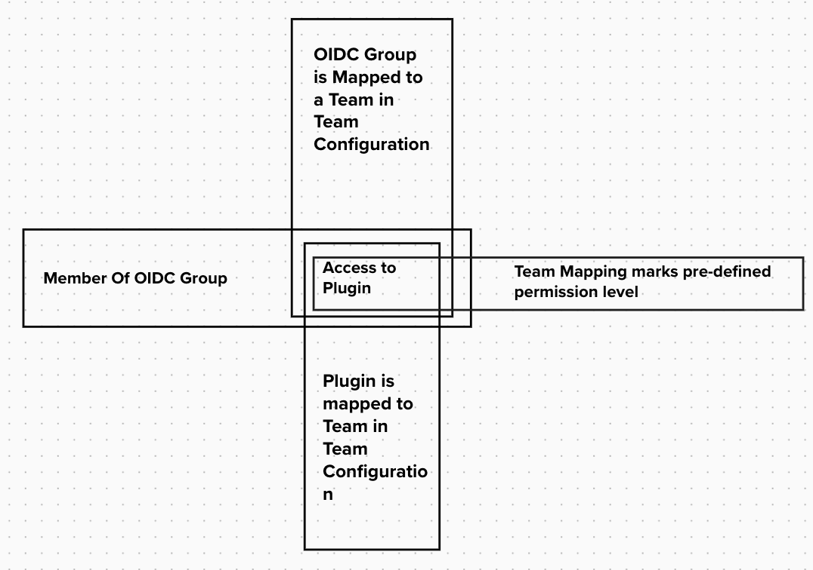
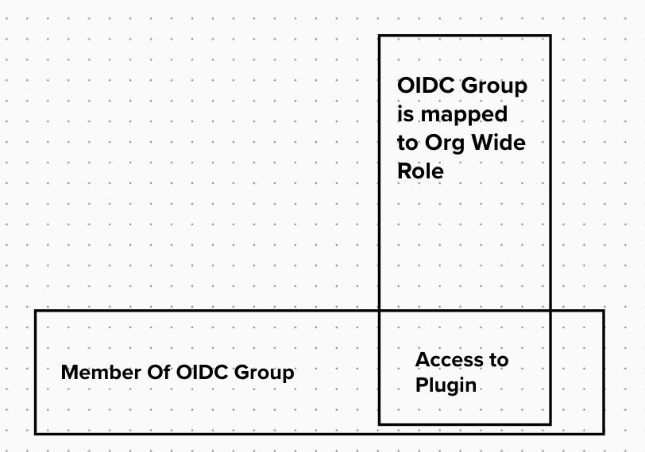
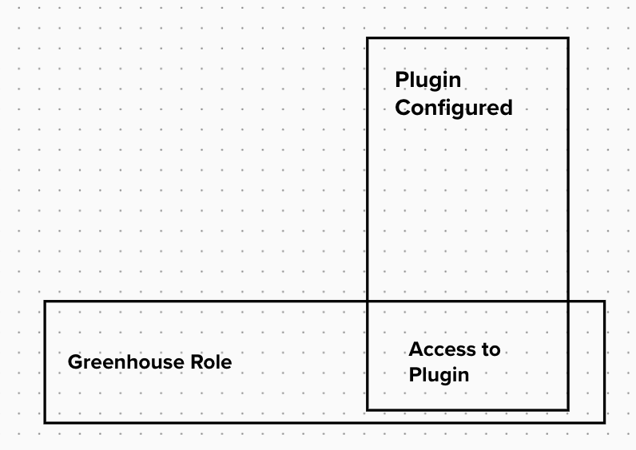
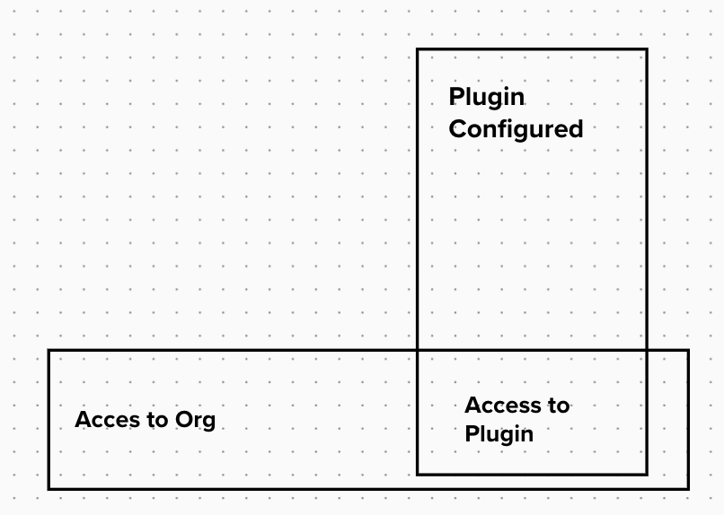

# ADR-1 Logical Authorization Concept for Greenhouse Plugins

## Decision Contributors

* Fabian Ruff 
* Esther Schmitz 
* Arno Uhlig
* Uwe Mayer
* David Rochow

## Status

- Preliminary decision taken

## Context and Problem Statement

Greenhouse is a Platform that aims to aggregate a vaierity of Applications into a single Platform using a Plugin Concept that allows Applications to be integrated into Greenhouse while beeing maintained and developed in a distributed manner.

Furthermore it intentionally does not support multi tenancy across Plugin Instances to enable segregation between tennants and make the Platform usable by totally unrelated LoB's.

While the Authorization concept for the Platform itself is clear, and rather simple, with Plugin Architecture of the Platform comes a challange in respect to the Authorization Concept for those and the unerlying architecture and constraints. 

This Decision record is about the Authorization Concept on a logical level to decide how permissions are mapped within Greenhouse.

## Decision Drivers

* Transparency:
    * Clear visibility about who has access to which Plugins within a Greenhouse Organization: 
        * without the need to know internals about the Plugin
        * within Greenhouse --> no need to view Source Code, Deployed Configuration, Pipeline etc. 
* Open for Adoption: 
    * It should not block applications to get ported to Greenhouse Plugins
    * It should follow industry standards as good as possible
    * It should enable support of other OIDC Providers then CCloud to be used
* Open to Automation:
    * Potential capability of automation and simplification in regards to CAM Profile Management
    * Potential capability for automated integration of Plugin Instance Backends to central Greenhouse configuration
* Standardization:
    * Supports standardization and harmonization of Role Concepts
* Ease of Use:
    * It should be as easy as possible for end users to manage the access to Plugins 

* Avoidance of compliance implications:
    * Do not re-introduce already fullfilled compliance requirements (by CAM) such as:
        *  Approval Processes
        *  Role Ownerships
        *  Automatic Access Revocation
        *  Time constrained Role assignements

## Considered Options

* Permission Mapping via Teams with Plugin provided Access levels
* Permission Mapping via Teams with predefined set of Access Levels
* Permission Mapping via Org Wide Roles
* Permission Mapping via Greenhouse Roles
* No permission mapping

## Decision Outcome

We decided to approach the situation with a phased approach. And in the first Phase of Greenhouse we go with: 

* No permission mapping 

Main drivers for this decision have been: 
* The first plugins that are about to get integrated do not require any permission model/authorization concept for the Plugins itself.
* The capability of auto-creating roles & access leves through Greenhouse on CAM is considered an advanced feature not planned for the initial phase.

This is not considered a final decision and rather as an intermediate step. The final decision about one of the described approaches is going to happen in future and documented in a seperate ADR.

### Consequences

**Good**
* Smaller implementation effort 
* We do not shoot for a solution of a problem that we right now do not have
* We can concetrate on core features that are required for the MVP

**Bad**
* Does most likely not work as a final solution
* Worst overall ratings in terms of decision drivers
* Everything we build need to consider the potential approaches described in this document, to not create blockers for any of the potential final solutions

## Evaluation of Options

### Permission Mapping via Teams with Plugin provided Access levels

In this solution the Access to a Plugin is granted based on 4 Factors: 

* The user is member of a OIDC Group 
* The respective Group is mapped to a Team within the Team Configuration
* The Plugin is mapped to the Team
* The permission which the Team gives to the Plugin is set within the Plugin to Team Map, where the Plugin does provide the permission levels.

| Decision Driver   | Rating | Reason |
| -------- | -------- | -------- |
| Transparency | +++ | * Gives full overview who has access to a Plugin within Greenhouse, including access levels |
| Open for Adoption | +++ | Allows Plugins to use as many roles as they want, and as they are on a existing app already |
| Open for Automation | +++ | We could integrate in future CAM profile and Access Level creation |
| Standardization | --- | Giving Plugins the full flexibility of choosing any amount of Roles they want and name them how they want discourages standardization and harmonization |
| Ease of Use | -- | If a plugin wants to use multiple Roles the Org Admin has to be aware of those and they are not ensured to be standardized therefore a assignment would be probably not intuitive and would require the Org Admin to read the Permission Level descriptions. |
| Avoidance of compliance implications | +++ | The actuall access provisioning is still done via CAM inlcuding all the Compliance related processes |

### Permission Mapping via Teams with predefined set of Access Levels

In this solution the Access to a Plugin is granted based on 4 Factors: 

* The user is member of a OIDC Group 
* The respective Group is mapped to a Team within the Team Configuration
* The Plugin is mapped to the Team
* The permission which the Team gives to the Plugin is set within the Plugin to Team Map, where you can select from a default set which are (open to change):
  * Admin
  * User
  * Viewer

| Decision Driver   | Rating | Reason |
| -------- | -------- | -------- |
| Transparency | +++ | Gives full overview who has access to a Plugin within Greenhouse |
| Open for Adoption | ++ | Predefined set of (e.g. 3 Access Levels) can catch 99% of use cases for role segregation |
| Open for Automation | +++ | We could integrate in future CAM profile and Access Level creation |
| Standardization | +++ | We can enforce a clear set of Roles to be used on Plugins |
| Ease of Use | o | Whole Permission Configuration is configured on a single place (within Greenhouse), the ability to select different access levels comes with additional configurations steps though |
| Avoidance of compliance implications | +++ | The actuall access provisioning is still done via CAM inlcuding all the Compliance related processes |

### Permission Mapping via Org Wide Roles

This Solution would grant access to a Plugin based on 2 Factors:
- User is Member of OIDC Group
- The User is mapped to one of the 3 pre-defined Organization Roles

The main difference here is that we seperate Teams from Role assignments. 

| Decision Driver   | Rating | Reason |
| -------- | -------- | -------- |
| Transparency | +++ | Gives full overview who has access to a Plugin within Greenhouse |
| Open for Adoption | + | Predefined set of (e.g. 3 Access Levels) can catch 99% of use cases for role segregation. Additionally we can not segregate access to individual plugins which could potentially be a problem |
| Open for Automation | +++ | We could integrate in future CAM profile and Access Level creation |
| Standardization | +++ | We can enforce a clear set of Roles to be used on Plugins |
| Ease of Use | + | Decoupling of Teams and Roles could lead to double effort in Management. The difference between teams and roles could be unintuitive and misleading. |
| Avoidance of compliance implications | +++ | The actuall access provisioning is still done via CAM inlcuding all the Compliance related processes |

### Permission Mapping via Greenhouse Roles

In this Solution we have 2 Factors that grant access to a Plugin:
- The user is member holds any Greenhouse Role (Greenhouse Admin, Organization Admin, Organization Member)
- The Plugin is configured for the Organization the user is part of.

| Decision Driver   | Rating | Reason |
| -------- | -------- | -------- |
| Transparency | + | We would implicitly know who has access by looking who has which role on Greenhouse. As greenhouse membership is defined through teams the member derivation  is actually automtically mapped to multiple teams |
| Open for Adoption | - | Only allows 2 Roles to be used by Plugins. We can not segregate access to individual plugins which could potentially be a problem.| We could integrate in future CAM profile and Access Level creation. Would lead potentially to a lot of profiles on CAM with the same access level. |
| Open for Automation | ++ | We could integrate in future CAM profile and Access Level creation. Would lead potentially to a lot of profiles on CAM with the same access levels |
| Standardization | ++ | We would encourage that we have only 2 Roles on a organization to be applied to all Plugins |
| Ease of Use | ++ | No additional burden of permission management except for Org Admins |
| Avoidance of compliance implications | +++ | The actuall access provisioning is still done via CAM inlcuding all the Compliance related processes |

### No permission mapping

In this Solution we do not have any Authorization check for Plugins. Meaning if you are member of a Organization you are able to Access all Plugins and the Plugins have no officially supported possibility to regulate fine grained access

| Decision Driver   | Rating | Reason |
| -------- | -------- | -------- |
| Transparency | - | We would implicitly know who has access by looking who has which role on Greenhouse. As greenhouse membership is defined through teams the member derivation is actually automtically mapped to multiple teams. This could lead to roles beeing used in the background | 
| Open for Adoption | -- | Encourages Plugins to use only 1 Role or manage permissions in addition outside of Greenhouse |
| Open for Automation | o | Automation of Role Provisioning would be probably unnecessarry from Greenhouse perspective |
| Standardization | o | We would basically encourage to use no roles in Plugins |
| Ease of Use | +++ | No additional burden of permission management except for Org Admins |
| Avoidance of compliance implications | +++ | The actuall access provisioning is still done via CAM inlcuding all the Compliance related processes |

## Related Decision Records 

ADR-2 Technical Implementation of Authorization Concept for Greenhouse Plugins
