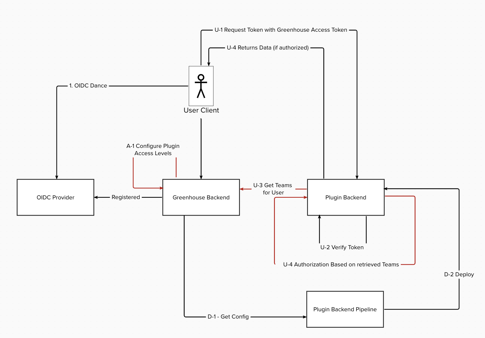
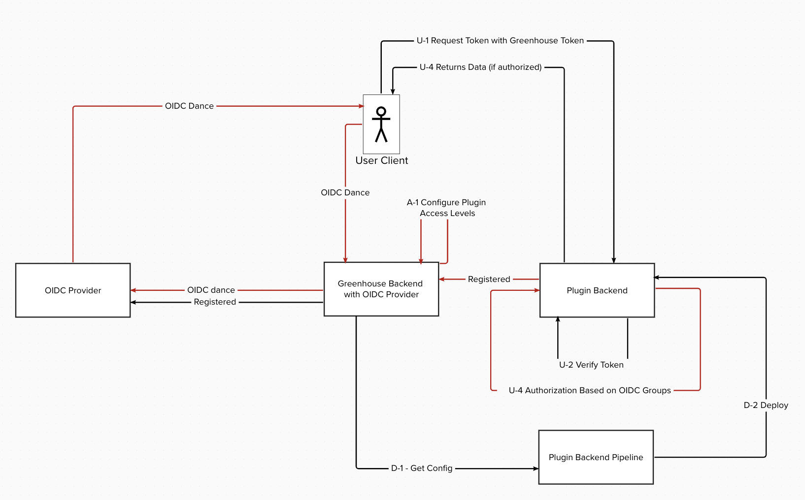

# ADR-2 Technical Implementation of access Authorization for Greenhouse Plugins

## Decision Contributors

* Fabian Ruff 
* Esther Schmitz 
* Arno Uhlig
* Uwe Mayer
* David Rochow

## Status

- PoC for selected solution running

## Context and Problem Statement

Greenhouse is a Platform that aims to aggregate a vaierity of Applications into a single Platform using a Plugin Concept that allows Applications to be integrated into Greenhouse while beeing maintained and developed in a distributed manner.

Furthermore, it intentionally does not support multi tenancy across Plugin Instances to enable segregation between tennants and make the Platform usable by totally unrelated LoB's.

This Decision record is about the technical solution how we do Authorizations for Plugins. 

## Decision Drivers

* Enables support of multiple Identitiy Providers
    * To allow Organizations to use their own IdP
* Open for adoption 
    * allows also Plugin Backends to be used that are not developed internally
* Support of Role Mapping within Greenhouse 
    * Supports the usage of any of the considered solutions of ADR-1
* Supports running Greenhouse components in a single Kubernetes Cluster 
    * On kubernetes you can only configure one OIDC Provider
* Implementation effort
* Maintenance effort

## Considered Options

* Team Sync during Deployment
* Team Sync by Plugin  during runtime 
* Usage of internal IdP for Group Ownership Rewriting based on Greenhouse mappings

## Decision Outcome

We decided to go with: 
* Usage of internal IdP for Group Ownership Rewriting based on Greenhouse mappings

### Consequences

**Good**
* Overall best decision driver ratings
* Most flexible solution 
* Does not require additional syncing of mappings between Greenhouse and Plugins
* We are in control of the OIDC Provider that is used for Authorization of Requests on Plugins 
* The authentication is still happening on the external Identitiy Provider 
* Only of the Solutions that solves the Kubernetes problem(just supports one OIDC Procider) by design

**Bad**
* Introduction of a additional Open Source Project
* In case we need to support Plugin Backends outside of the Converged Cloud, we would need to somewhow expose the internal OIDC Provider or build an additional proxy solution.
* This solution is expected to require the most implementation and maintenance effort

## Evaluation of Options

### Team Sync during Deployment

This Solution is using an external OIDC Provider. Within Greenhouse, mappings from OIDC Groups to Plugin Permissions are done and the respective mappings are distributed to Plugins during the deployment of the Plugins. 

This means any change in the mapping of a Team/Role would require a re-deployment of the Plugins to happen. 

| Decision Driver   | Rating | Reason |
| -------- | -------- | -------- |
| Enables support of multiple Identitiy Providers | + | possible |
| Open for adoption | + | Would use 100% standard OIDC for Authorization on Plugin Side. Organizations would be forced to use a OIDC Provider though. |
| Support of Role Mapping within Greenhouse | + | supports with variations in the details all options |
| Supports running Greenhouse components in a single Kubernetes Cluster | - | unclear, how this would be solved |
| Implementation effort | o |  |
| Maintenenace effort | - | The required redeployment of components|

### Team Sync by Plugin during runtime

In this Solution we use a external OIDC provider as well. The mapping of Access Levels for Plugins is also done within Greenhouse. The difference is that the mapping of OIDC Groups to permissions is fetched from the Plugin at runtime from Greenhouse using a API endpoint implemented for this purpose. 

| Decision Driver   | Rating | Reason |
| -------- | -------- | -------- |
| Enables support of multiple Identitiy Providers | + | possible |
| Open for adoption | - | Would use for the Authorization a custom implmentation through retrieving the mapping |
| Support of Role Mapping within Greenhouse | + | supports with variations in the implementation details all options |
| Supports running Greenhouse components in a single Kubernetes Cluster | - | unclear how this would be solved |
| Implementation effort | - | We would need to create an additional API Endpoint |
| Maintenenace effort | o | Neutral |

### Usage of internal IdP for Group Ownership Rewriting based on Greenhouse mappings

This Solution does use a federated IdP that handles the authorization. The Idea here is to us any external Authentication Provider (which could also be something else then a OIDC provider) and use an internal OIDC Provider that is used for the Plugins and Kubernetes. Within the internal OIDC Provider we can then create the Group to Role mappings for plugins before issuing the a Token. 
This way the Token would include all custom Permission mappings that we configure in Greenhouse using a standardized approach. This also means that Plugins can either advertise theire expected naming schema with theire Plugin Schema or use a default pre-defined schema that all Greenhouse Plugins are using.

| Decision Driver   | Rating | Reason |
| -------- | -------- | -------- |
| Enables support of multiple Identitiy Providers | +++ | Even allows usage of other Protocols than OIDC |
| Open for adoption | +++ | Openness for different Identity providers enables Organizations to have a very flexible choice |
| Support of Role Mapping within Greenhouse | + | Supports all the variants |
| Supports running Greenhouse components in a single Kubernetes Cluster | +++ | We would internally use only our internal OIDC Provider for issuing tokens which would solve the problem that Kubernetes Clusters only support one OIDC Procider |
| Implementation effort | - | Probably more effort to implement than other solutions|
| Maintenenace effort | - | Probably more maintenance effort than the other solutions especially due to the additional open source dependencies introduced |

## Related Decision Records 

ADR-1 Logical Auhtorization Concept for Greenhouse Plugins

