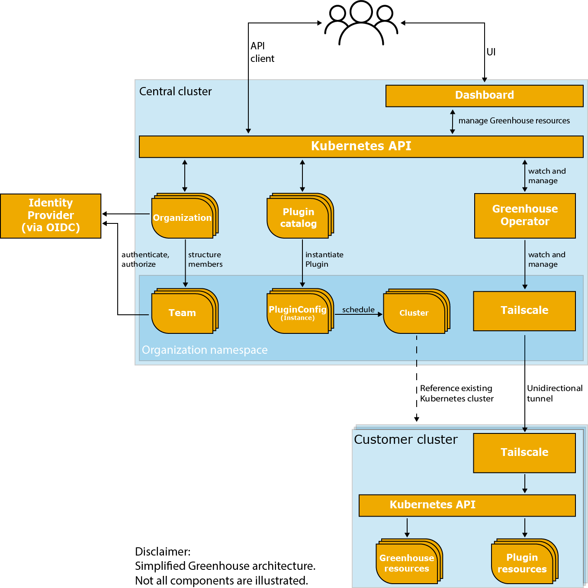

This section provides a high-level overview of the Greenhouse concepts.

## Greenhouse components

Conceptually, the Greenhouse platform consists of 2 types of Kubernetes cluster fulfilling specific purposes.

1) **Central cluster**  

    The central cluster accommodates the core components of the Greenhouse platform,
    providing the holistic API and dashboard to let users manage their entire cloud infrastructure from a single control point.  
    Users of the Greenhouse cloud operations platform, depending on their roles, can perform tasks such as managing organizations, 
    configuring and using plugins, monitoring resources, developing custom plugins, and conducting audits to ensure compliance with standards.   
    Greenhouse's flexibility allows users to efficiently manage cloud infrastructure and applications while tailoring their experience to organizational needs.  
    The configuration and metadata is persisted in Kubernetes custom resource definitions (CRDs), acted upon by the Greenhouse operator and managed in the customer cluster.
   

2) **Customer cluster**  

    Managing and operating Kubernetes clusters can be challenging due to the complexity of tasks related to orchestration, scaling, and ensuring high availability in containerized environments.  
    By onboarding their Kubernetes clusters into Greenhouse, users can centralize cluster management, streamlining tasks like resource monitoring and access control.  
    This integration enhances visibility, simplifies operational tasks, and ensures better compliance, enabling users to efficiently manage and optimize their Kubernetes infrastructure.
    While the central cluster contains the user configuration and metadata, all workloads of user-selected Plugins are run in the customer cluster and managed by Greenhouse.

A simplified architecture of the Greenhouse platform is illustrated below. 

