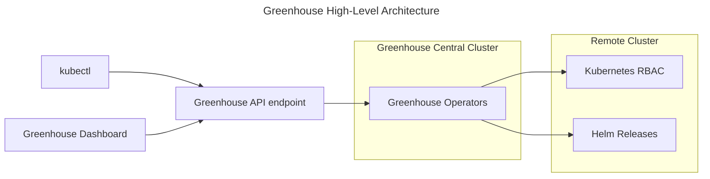
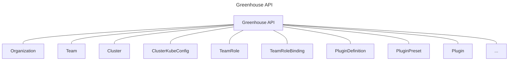
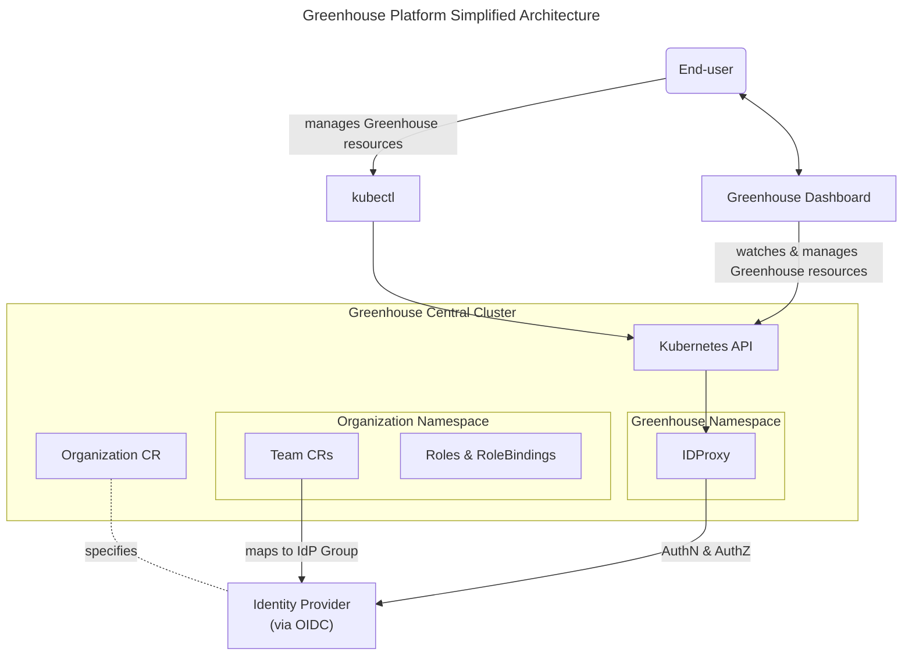
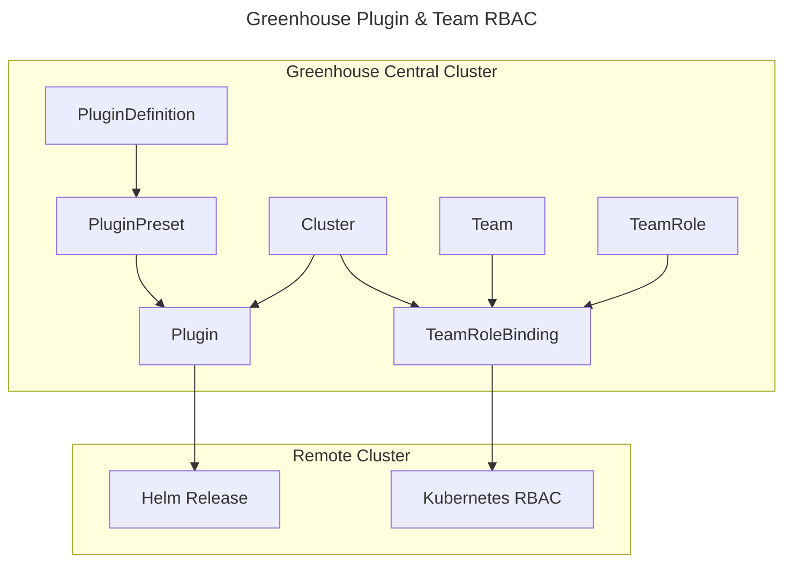

## Greenhouse components

From a high-level perspective, the Greenhouse platform consists of these main components:

1. **Greenhouse Central Cluster**: The API Server of the central Greenhouse cluster serves as the API endpoint that acts as the primary interface for users to interact with the Greenhouse platform. The API consists of the Greenhouse Custom Resource Definitions (CRDs). Interactions with the API are possible via the Greenhouse dashboard and the `kubectl` command line tool. The Greenhouse operators run inside this central cluster.
2. **Remote Clusters**: The are the clusters that are onboarded into Greenhouse, so that the Greenhouse operators can manage the lifecycle of Greenhouse resources in these clusters.

## Greenhouse API

The Greenhouse API serves as the backbone of the platform, offering a familiar interface for interacting with Greenhouse. It is deliberately not exposing all the Kubernetes APIs to the users, but uses RBAC to limit the available resources to the ones that are relevant for the use of Greenhouse. For example it is not permitted to run arbitrary workload resources inside of the Greenhouse central clusters.

## Greenhouse Clusters

When talking about clusters in the context of Greenhouse, we are referring to two different types of clusters:

1) **Central cluster**

    This is the cluster where all of the Greenhouse components are running. It is the central point of access for users to interact with the platform. The dashboard, Kubernetes API and the operator are all running in this cluster. It is possible to mutliple organizations on one central cluster. They are isolated by dedicated Kubernetes Namespaces created for each Organization. The Kubernetes API access is limited to the Custom Resource Definitions (CRDs) that are relevant for the Greenhouse platform, such as Organizations, Teams, Clusters, TeamRoleBindings, PluginPresets and more.

    Users of the Greenhouse cloud operations platform, depending on their roles, can perform tasks such as managing Organizations,
    configuring and using Plugins, monitoring resources, developing custom PluginDefinitions, and conducting audits to ensure compliance with standards.
    Greenhouse's flexibility allows users to efficiently manage cloud infrastructure and applications while tailoring their experience to organizational needs.
    The configuration and metadata is persisted in Kubernetes custom resource definitions (CRDs), acted upon by the Greenhouse operator and managed in the remote cluster.

2) **Remote cluster**

    When referring to a remote cluster we are talking about the clusters that are onboarded into Greenhouse. Onboarding means that a valid KubeConfig is provided so that the Greenhouse operator can access the cluster and manage the resources in it.
    Managing and operating Kubernetes clusters can be challenging due to the complexity of tasks related to orchestration, scaling, and ensuring high availability in containerized environments.  
    By onboarding their Kubernetes clusters into Greenhouse, users can centralize cluster management, streamlining tasks like resource monitoring and access control.
    This integration enhances visibility, simplifies operational tasks, and ensures better compliance, enabling users to efficiently manage and optimize their Kubernetes infrastructure.
    While the central cluster contains the user configuration and metadata, all workloads of user-selected Plugins are run in the remote cluster and managed by Greenhouse.
    More information about the Cluster resources can be found [here](../getting-started/core-concepts/clusters).

## Organizations & Authentication

The Greenhouse platform is designed to support multiple organizations, each with its own set of users and permissions. Each organization can have multiple teams, and each team can have its own set of roles and permissions. The Greenhouse API provides a way to manage these organizations, teams, and roles.
The Organization is a cluster-scoped resource for which a namespace with the same name will be created. When creating an Organization an identity provider (IdP) needs to be specified. All users in this IdP have read access to the resources in the Organization's namespace. Greenhouse will automatically provision a set of RBAC roles, more information can be found [here](../getting-started/core-concepts/organizations).
In order to make the Kubernetes API available for multiple organizations, Greenhouse provides an idproxy build on-top of [dex](https://dexidp.io/), which allows to handle different identity providers (IdP) when authenticating users against the Kubernetes API.

## Remote Cluster management with Plugins & Team RBAC

Greenhouse provides a way to manage access and tooling (e.g. monitoring, security, compliance, etc.) on a Kubernetes cluster through the use of Plugins and TeameRoleBindings. Plugins are used to deploy and manage workloads (e.g. Prometheus, Open Telemetry, Cert-Manager, etc.) in the remote clusters, while TeamRoleBindings are used to manage access to the remote clusters through Kubernetes RBAC. Details about Team RBAC can be found [here](../getting-started/core-concepts/teams).

The Plugin API is a key feature of Greenhouse, allowing domain experts to extend the core platform with custom functionality. Greenhouse provides rollout and lifecyle management of Plugins to onboarded Kubernetes Clusters. PluginDefinitions define a Helm chart and/or UI (to be displayed on the Greenhouse dashboard) with pre-configured default values. A PluginPreset can be used to create and configure Plugins for a set of Clusters. [Here](../getting-started/core-concepts/plugins) you can find more information about the Plugin API.

Access in the remote clusters is managed via TeamRole and TeamRoleBinding resources. TeamRoles define the permissions, similar to RBAC Roles & ClusterRoles. The Greenhouse operator will create the necessary Kubernetes RBAC resources in the remote clusters based on the TeamRoleBinding. The TeamRoleBinding combines the TeamRole with a Team and defines the target Clusters and Namespaces.

