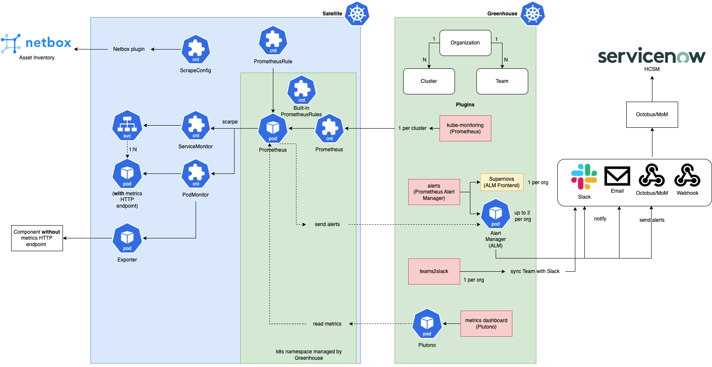

This section provides an overview of the Greenhouse monitoring components. 

## Monitoring components

1) **Metrics**  

    The **kube-monitoring** plugin is intended for monitoring remote Kubernetes clusters and is preconfigured to collect metrics from all Kubernetes components. It also comes with a default set of Kubernetes alerting rules. The plugin includes `Prometheus`, `Prometheus operator`, `Prometheus node exporter` and `kube-state-metrics`. The plugin is provided in its own namespace, which is managed by Greenhouse. `Prometheus` and `Prometheus operator` configurations can also be extended to process customer metrics and alerts.

2) **Visualization/Dashboard**

   With the **plutono** plugin, you can deploy Plutono, a fork of Grafana `7.5.17` in the Greenhouse central cluster,    to query Prometheus metrics and visualize them in dynamic dashboards.  

3) **Alerts**

    The **alerts** plugin contains the `Prometheus Alertmanager` and `Supernova` as user interface. 
    It is deployed in the Greenhouse central cluster in the customer org namespace. 
    The Alertmanager receives alerts from the Prometheis in the remote Kubernetes clusters.  
    Supernova is a user-friendly interface for the Alertmanager. It provides a grouped overview of the alerts with additional simple filter options. 

4) **Notifications**

    The `Alertmanager` can send out notifications to different receivers (e.g. Slack, Email, ...) based on alert labels.

The Greenhouse monitoring components and their interactions are illustrated below.

