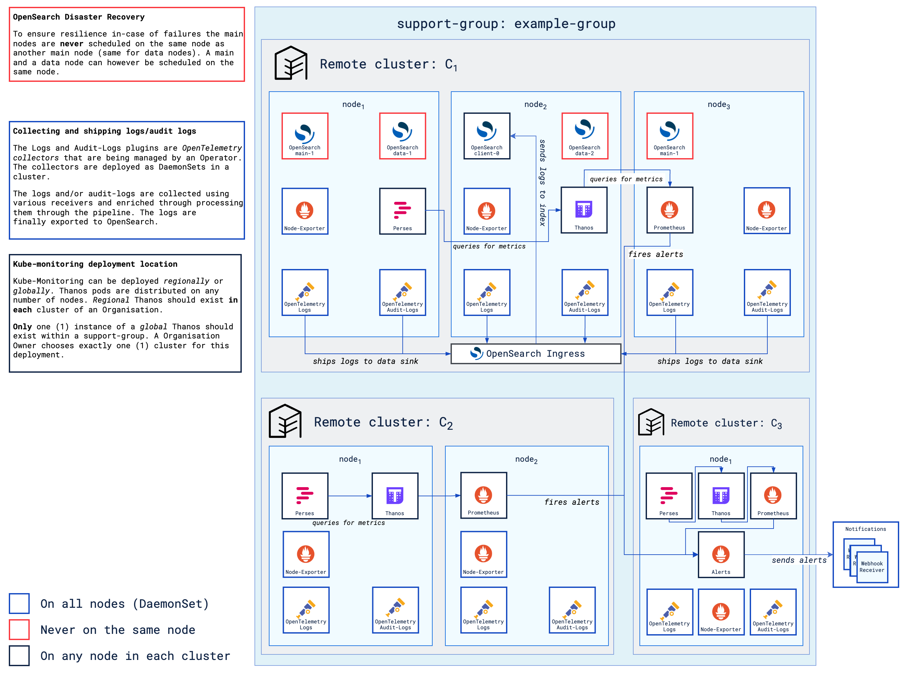

The main terminologies used in this document can be found in [core-concepts](https://cloudoperators.github.io/greenhouse/docs/getting-started/core-concepts).

## Introduction to Observability

Observability in software and infrastructure is essential for operating a complex cloud environment. High-quality observability will enable teams to:

- Detect and troubleshoot issues quickly,
- Maintain performance and reliability,
- Make data-driven improvements.

### Core Signals

The three key signals of observability are **metrics**, **logs**, and **traces**, each providing unique insights contributing to a comprehensive view of a system's health.

#### Metrics
Metrics are numerical data points reporting on a system health over time. Examples of metrics can be CPU usage, memory usage, request latency.

#### Logs
Logs are detailed records of system or application events. These can be in various formats like structured/unstructured, single-/multi-line or written to files/streamed. Logs provide text-based data for post-incident analysis and crucial for auditing, troubleshooting or improving a system.

#### Traces
Traces follow a request's journey through the system, capturing latency and failures across microservices. Traces are key for understanding dependencies, diagnosing bottlenecks and debugging the source code with real system data.

### Tools
Common Open Source Tools to capture these signals are:
- **[Prometheus](https://prometheus.io)** is a tool for collecting and querying metrics. It uses a time-series database optimized for real-time data, making it ideal for gathering system health data, enabling alerting, and visualizing trends.
- **[OpenSearch](https://opensearch.org)** provides a scalable platform for log indexing, search, and analysis of logs. Enabling teams to sift through large volumes of logs to identify issues and understand system behaviour over time.
- **[Jaeger](https://www.jaegertracing.io)** is a tool for distributed tracing, providing a detailed view of request paths and performance across services.
- **[OpenTelemetry](https://opentelemetry.io)** was developed as a framework for instrumenting applications and infrastructures to collect metrics, logs and traces. It defines a standard for unifying the processing of all three types of signals. In addition to providing an API and SDKs for multiple programming languages, **OpenTelemetry** also simplifies the integration with backend systems such as Prometheus, OpenSearch and Jaeger.

## Observability in Greenhouse

Greenhouse provides a suite of Plugins, including pre-packaged configurations for monitoring and logging tools. These *Plugins* are designed to simplify the setup and configuration of observability components. It enables users to quickly deploy monitoring and logging solutions to their Greenhouse clusters.

The following *Plugins* are currently available:

- [Kube-Monitoring](https://cloudoperators.github.io/greenhouse/docs/reference/catalog/kube-monitoring): installs *[Prometheus](https://prometheus.io)* to collect custom and Kubernetes specific metrics with standard Kubernetes alerting enabled. 
- [Thanos](https://cloudoperators.github.io/greenhouse/docs/reference/catalog/thanos): installs *[Thanos](https://thanos.io)* to enable long term metric retention and unified metric accessibility.
- [Perses](https://cloudoperators.github.io/greenhouse/docs/reference/catalog/perses): installs *[Perses](https://perses.dev)* an open cloud native dashboard tool for Prometheus and other data sources
- [Alerts](https://cloudoperators.github.io/greenhouse/docs/reference/catalog/alerts): installs *[Prometheus AlertManager](https://prometheus.io/docs/alerting/latest/alertmanager/)* and *[Supernova](https://github.com/sapcc/supernova)* to manage and visualize alerts sent by Prometheus.
- [Logs](https://cloudoperators.github.io/greenhouse/docs/reference/catalog/logs): installs *[OpenTelemetry](https://opentelemetry.io)* in the form of *[OpenTelemetryCollectors](https://github.com/open-telemetry/opentelemetry-collector)* to collect metrics and logs from applications and forward them to backends like Prometheus and OpenSearch.
- [Audit-Logs](https://cloudoperators.github.io/greenhouse/docs/reference/catalog/audit-logs): installs *[OpenTelemetry](https://opentelemetry.io)* in the form of *[OpenTelemetryCollectors](https://github.com/open-telemetry/opentelemetry-collector)* to collect *audit-relevant* logs from applications and forward them to backends like Prometheus and OpenSearch.

## Overview Architecture
<figure>
  
  <figcaption><i>This is a high-level depiction of how the Greenhouse Extensions (Plugins) interact on central and a remote-cluster.</i></figcaption>
</figure>

<figure>
  
  <figcaption><i>Traffic and data flow that happens for a particular application within its own domain has been omitted for simplicity. For more information please visit <a href=https://github.com/cloudoperators/greenhouse-extensions>Greenhouse Extensions</a> to read up more on the inner workings of each application.</i></figcaption>
</figure>

