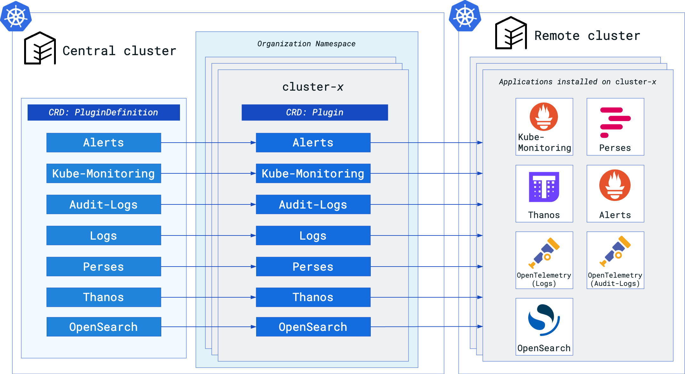

The main terminologies used in this document can be found in [core-concepts](https://cloudoperators.github.io/greenhouse/docs/getting-started/core-concepts).

## Introduction to Observability

Observability in software and infrastructure has become essential for operating the complex modern cloud environments. The concept centers on understanding the internal states of systems based on the data they produce, enabling teams to:

-   Detect and troubleshoot issues quickly,
-	Maintain performance and reliability,
-	Make data-driven improvements.

## Core Signals and Open Source Tools

Key pillars of observability are **metrics**, **logs**, and **traces**, each providing unique insights that contribute to a comprehensive view of a system’s health.

- **Metrics:** 
	- Metrics are numerical data points representing system health over time (e.g., CPU usage, memory usage, request latency).
	- **Prometheus** is a widely used tool for collecting and querying metrics. It uses a time-series database optimized for real-time data, making it ideal for gathering system health data, enabling alerting, and visualizing trends.

- **Logs:**
	- Logs capture detailed, structured/unstructured records of system events, which are essential for post-incident analysis and troubleshooting.
	- **OpenSearch** provides a robust, scalable platform for log indexing, search, and analysis, enabling teams to sift through large volumes of logs to identify issues and understand system behavior over time.

- **Traces:**
	-	Traces follow a request’s journey through the system, capturing latency and failures across microservices. Traces are key for understanding dependencies and diagnosing bottlenecks.
	- **Jaeger** is a popular open-source tool for distributed tracing, providing a detailed view of request paths and performance across services.

To provide a unified approach to open source observability, [OpenTelemetry](https://opentelemetry.io) was developed as a framework for instrumenting applications and infrastructures to collect metrics, logs and traces. In addition to providing a unified API and SDKs for multiple programming languages, **OpenTelemetry** also simplifies the integration of various backend systems such as Prometheus, OpenSearch and Jaeger.

## Observability in Greenhouse

Greenhouse provides a suite of Plugins which consist of pre-packaged configurations for monitoring and logging tools. These Plugins are designed to simplify the setup and configuration of observability components, enabling users to quickly deploy and manage monitoring and logging for their Greenhouse-onboarded Kubernetes clusters.

The following Plugins are available currently:

- [Kubernetes Monitoring](https://cloudoperators.github.io/greenhouse/docs/reference/catalog/kube-monitoring): Prometheus, to collect custom and Kubernetes specific metrics with standard Kubernetes alerting enabled. 
- [Thanos](https://cloudoperators.github.io/greenhouse/docs/reference/catalog/thanos): Thanos, to enable long term metric retention and unified metric accessibility.
- [Plutono](https://cloudoperators.github.io/greenhouse/docs/reference/catalog/plutono): Grafana fork, to create dynamic dashboards for metrics.
- [Alerts](https://cloudoperators.github.io/greenhouse/docs/reference/catalog/alerts): Prometheus Alertmanager and Supernova, to manage and visualize alerts sent by Prometheus.
- [OpenTelemetry](https://cloudoperators.github.io/greenhouse/docs/reference/catalog/opentelemetry): OpenTelemetry Pipelines, to collect metrics and logs from applications and forward them to backends like Prometheus and OpenSearch.

## Overview Architecture

