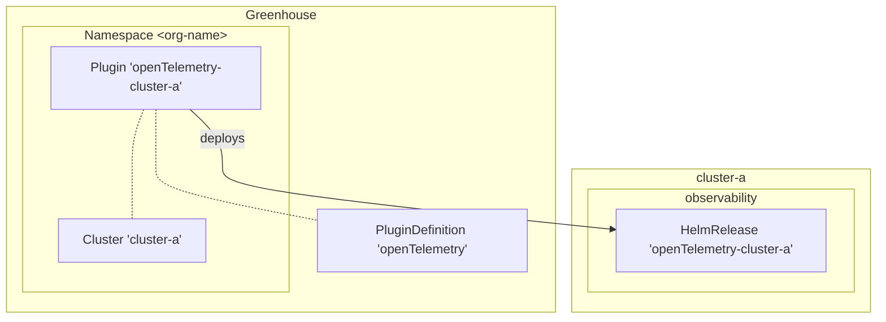
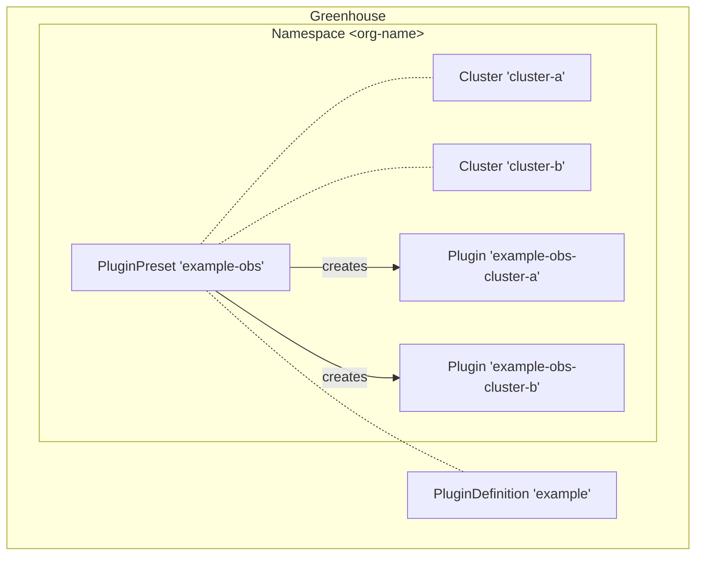

## What are PluginDefinitions and Plugins?

PluginDefinitons and Plugins are the Greenhouse way to extend the core functionality with domain specific features.
PluginDefinitions, as the name suggests, are the definition of a Plugin, whereas a Plugin is a concrete instance of a PluginDefinition that is deployed to a Cluster.

The PluginDefinitions are shared between all Organizations in Greenhouse. A PluginDefinition can include a frontend, that is displayed in the Greenhouse dashboard and/or a backend component. The frontend is expected to be a standalone microfrontend created with the [Juno framework](https://github.com/cloudoperators/juno).
The backend components of a PluginDefinition are packaged as a Helm Chart and provide sane and opinionated default values. This allows Greenhouse to package and distribute tools such as Prometheus with a sensible default configuration, as well as giving the user a list of configurable values.

A Plugin is used to deploy the Helm Chart referenced in a PluginDefinition to a Cluster. The Plugin can be considered as an instance of a PluginDefinition, this instance specifies the PluginDefinition, the desired Cluster and additional values to set. Depending on the PluginDefinition, it may be necessary to specify required values (e.g. credentials, endpoints, etc.), but in general the PluginDefinition provides well-established default values.

> [!NOTE]
> In this example the Plugin 'openTelemetry-cluster-a' is used to deploy the PluginDefinition 'openTelemetry' to the cluster 'cluster-a'.

## PluginPresets

PluginPresets are a mechanism to configure Plugins for multiple clusters at once. They are used to define a common configuration for a PluginDefinition that can be applied to multiple clusters, while allowing to override the configuration for individual clusters.

> [!NOTE]
> In this example the PluginPreset 'example-obs' references the PluginDefinition 'example' and contains a clusterSelector that matches the clusters 'cluster-a' and 'cluster-b'. The PluginPreset creates two Plugins 'example-obs-cluster-a' and 'example-obs-cluster-b' for the respective clusters.

## Next Steps

- [Creating an Organization](./../../../user-guides/organization/creation)
- [Plugin reference](./../../../reference/components/plugin)
- [PluginPreset reference](./../../../reference/components/pluginpreset)
- [PluginDefinition reference](./../../../reference/components/plugindefinition)
