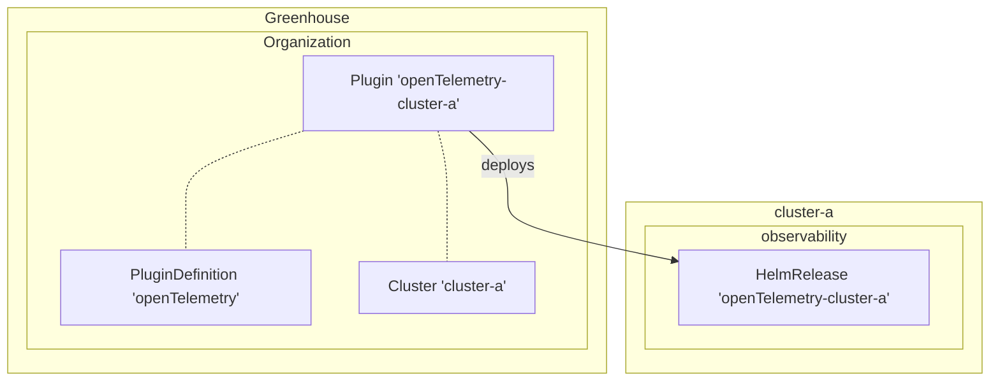
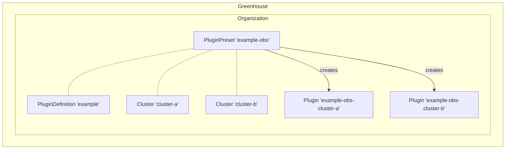

## What are Plugin Definitions?

PluginDefinitions are a way to extend the functionality of the platform. They can include a [Juno microfrontend](https://github.com/cloudoperators/juno) into the Greenhouse Dashboard and/or a backend component. The backend components of a PluginDefinition is packaged as a Helm Chart and provides default values for the Helm Chart. This allows to package and distribute tools such as Prometheus with a sensible default configuration, as well as giving the user a list of configurable values.

## Plugins

In order to deploy the Helm Chart of a Plugin Definition into a particular cluster a Plugin is used. The Plugin specifies the PluginDefintion to deploy, the release namespace to use, the values to set and the cluster to deploy to. Depending on the PluginDefinition it may be required to provide required values (e.g. credentials, endpoints etc.), but in general the PluginDefinition provides sensible defaults.

> [!NOTE]
> In this example the Plugin 'openTelemetry-cluster-a' is used to deploy the PluginDefinition 'openTelemetry' to the cluster 'cluster-a'.

## PluginPresets

PluginPresets are a mechanism to configure Plugins for multiple clusters at once. They are used to define a common configuration for a PluginDefinition that can be applied to multiple clusters, while allowing to override the configuration for individual clusters.

> [!NOTE]
> In this example the PluginPreset 'example-obs' references the PluginDefinition 'example' and contains a clusterSelector that matches the clusters 'cluster-a' and 'cluster-b'. The PluginPreset creates two Plugins 'example-obs-cluster-a' and 'example-obs-cluster-b' for the respective clusters.

