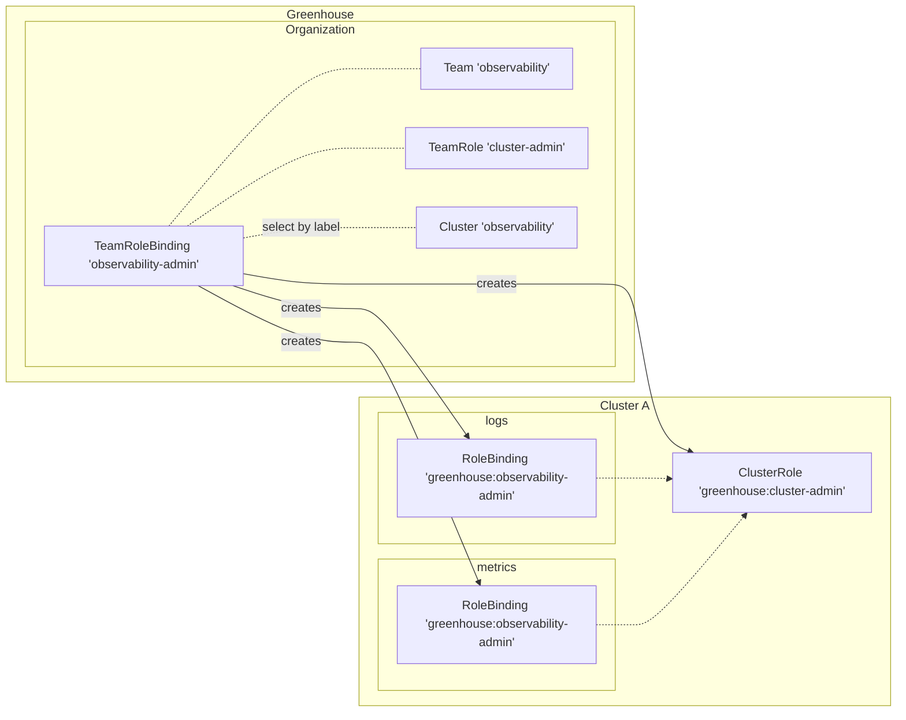

## What are Teams?

Teams are used to manage access to resources in Greenhouse and managed Kubernetes clusters. Each Team must be backed by a group in the identity provider (IdP) of the Organization. Teams are used to structure members of your Organization and assign fine-grained access and permission levels. The Greenhouse Dashboard is showing the members of a Team.

## Team RBAC

TeamRoles and TeamRoleBindings provide a mechanism to control the permissions of Teams to onboarded Clusters of an Organization.

Team role-based access control (RBAC) wraps the concept of Kubernetes RBAC in TeamRoles and TeamRoleBindings. TeamRoles are used to define a set of RBAC permissions. These permissions can be granted to Teams with TeamRoleBindings. A TeamRoleBinding refers to a Team, a TeamRole, Cluster(s) and optional Namespaces. Depending on the latter, Greenhouse will create the appropriate `rbacv1` resources on the targeted cluster(s) in either Cluster or Namespace scope.
More information about how this can be configured is mentioned in this [user guide](../../user-guides/team/rbac.md).

Example of a TeamRoleBinding for a `observability-admin` which grants the `cluster-admin` role on the `observability` cluster in the `logs` and `metrics` namespaces. The TeamRoleBinding contains a list of namespaces and a label selector to select the cluster(s) to target. If no Namespaces are provided, then Greenhouse will create a ClusterRoleBinding instead of a RoleBinding.

