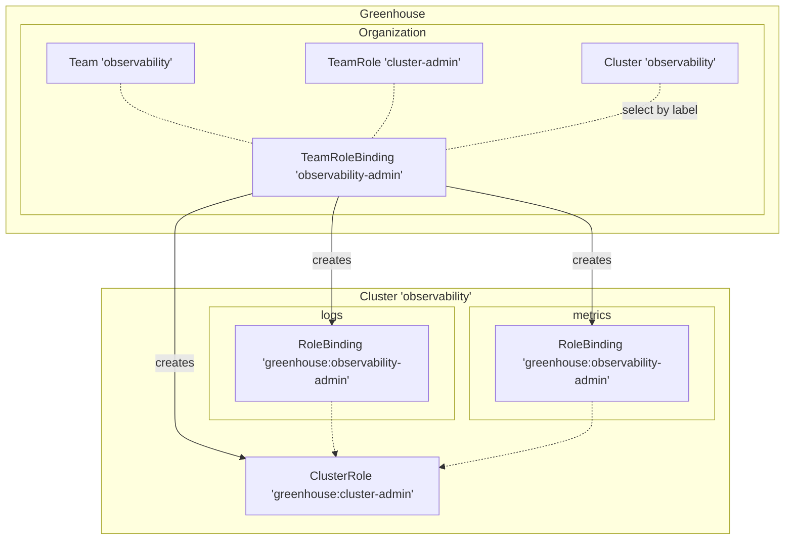

## What are Teams?

Teams in a Greenhouse Organization are used to group users by `group` claims on the token provided by the upstream identity provider (IdP).

This can be used, for example, for

- organizational management
- access and permission management
- identifying [`Ownership` of resources](./../../operations/ownership)

The Greenhouse UI is showing the members of a Team.

## Team RBAC

TeamRoles and TeamRoleBindings  provide a mechanism to control the permissions of Teams to onboarded Clusters of an Organization.

Team role-based access control (RBAC) wraps the concept of Kubernetes RBAC in TeamRoles and TeamRoleBindings . TeamRoles are used to define a set of RBAC permissions. These permissions can be granted to Teams with TeamRoleBindings . A TeamRoleBinding refers to a Team, a TeamRole , Cluster(s) and optional Namespaces. Depending on the latter, Greenhouse will create the appropriate `rbacv1` resources on the targeted cluster(s) in either Cluster or Namespace scope.
More information about how this can be configured is mentioned in this [user guide](./../../../user-guides/team/rbac).

Example of a TeamRoleBinding for a `observability-admin` which grants the `cluster-admin` TeamRole on the `observability` Cluster in the `logs` and `metrics` Namespaces. The TeamRoleBinding contains a list of Namespaces and a ClusterSelector to select the cluster(s) to target. Setting the `.spec.namespaces` field decides whether the created RBAC resources will be namespace-scoped or cluster-scoped.

```yaml
apiVersion: greenhouse.sap/v1alpha2
kind: TeamRoleBinding
metadata:
  name: observability-admin
spec:
  teamRef: observability
  roleRef: cluster-admin
  clusterSelector:
    clusterName: observability
  namespaces:
    - logs
    - metrics
```



## Support Groups

Support Groups in Greenhouse are a subset of Teams in an Organization. These Teams are used to identify response groups for operational tasks and to prefilter UI content.

Since a user can be part of many Teams the expectation is that they are only part of one Support Group.

To identify a Team as a Support Group in Greenhouse it needs to be labeled with `greenhouse.sap/support-group: "true"`.
