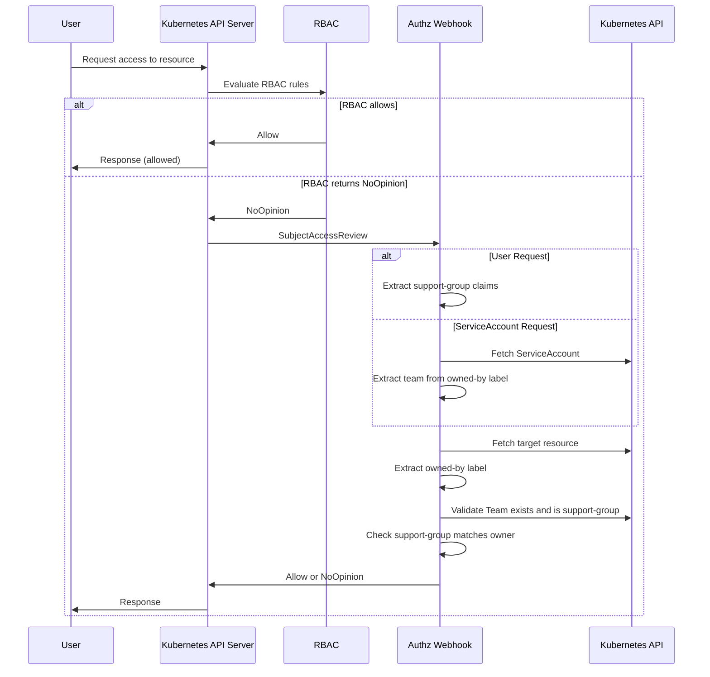

## Overview

The Greenhouse Authorization Webhook enforces fine-grained access control on Greenhouse resources based on Team ownership. The webhook checks if a user's **support-group claims** match the **`greenhouse.sap/owned-by` label** on resources before granting access.

This enables Teams to have **elevated permissions on resources they own**, while maintaining visibility across the Organization.

## Why This Exists

Greenhouse uses a **single namespace per Organization** for all resources. While this simplifies management, it requires a mechanism to allow Teams to manage their own resources without unrestricted access to resources owned by other Teams.

The authorization model combines two layers:

| Layer | Purpose |
|-------|---------|
| **RBAC** | Provides organization-wide permissions (e.g., view all resources, admin roles) |
| **Authorization Webhook** | Grants elevated permissions on resources owned by the requesting Team |

This allows:
- **All Teams** to view resources across their Organization (via RBAC)
- **Resource owners** to get, update, patch, and delete their own existing resources (via the webhook)
- **Organization admins** to manage resources organization-wide via RBAC roles (including create and collection operations)

## How It Works

The authorization webhook integrates with the Kubernetes API server's authorization chain as an additional authorizer **after RBAC**. When a user attempts to access a Greenhouse resource:

1. **RBAC is evaluated first** — If RBAC allows the request, it is granted immediately
2. **If RBAC returns NoOpinion** (no matching rule), the webhook is consulted for `greenhouse.sap` resources
3. The webhook extracts the user's **support-group claims** from their IdP token groups
4. It fetches the target resource and reads its **`greenhouse.sap/owned-by` label**
5. It validates that the referenced Team exists and is marked as a **support-group**
6. Access is **allowed** only if one of the user's support-groups matches the resource owner

If no authorizer in the chain allows the request, it is denied by default. Note that the webhook can only authorize requests targeting a **specific named resource** — collection operations (list, watch) must be granted via RBAC.

> **Note**: The webhook only handles resources in the `greenhouse.sap` API group. Core Kubernetes resources (Secrets, ConfigMaps, etc.) are authorized by RBAC only.

## Identity Resolution

The webhook supports two types of identities:

### User Requests

For human users, the webhook extracts support-group claims from the user's group memberships. Groups with the prefix `support-group:` are recognized as support-group claims.

**Example**: A user with groups `["support-group:my-team", "developers"]` would have `my-team` as their support-group.

Users are expected to belong to only one Support Group, as described in the [Teams documentation](../../core-concepts/teams#support-groups). However, the webhook also supports users with multiple `support-group:` claims and grants access if **any** of those claims matches the resource owner.

### ServiceAccount Requests (Team Automation)

ServiceAccounts enable Teams to set up automation that has the same elevated permissions on their owned resources as human team members.

For ServiceAccounts, the webhook:

1. Extracts the ServiceAccount name from the username (format: `system:serviceaccount:{namespace}:{name}`)
2. Fetches the ServiceAccount from the cluster
3. Extracts the team name from the `greenhouse.sap/owned-by` label on the ServiceAccount

The ServiceAccount is then authorized as if it were a member of the owning Team.

## Troubleshooting

| Error | Cause | Fix |
|-------|-------|-----|
| `user has no support-group claims and is not an authorized ServiceAccount` | User's IdP token has no `support-group:` prefixed groups | Ensure the IdP token includes claims in the format `support-group:{team-name}` |
| `resource has no owned-by label` | Target resource is missing `greenhouse.sap/owned-by` | `kubectl label <resource> <name> greenhouse.sap/owned-by=<team> -n <org>` |
| `team <name> is not a support-group` | Team exists but lacks `greenhouse.sap/support-group: "true"` | `kubectl label team <name> greenhouse.sap/support-group=true -n <org>` |
| `support-group does not match resource owner` | User's support-group doesn't match the resource's `owned-by` label | Verify the user's group membership and the resource label are consistent |
| `ServiceAccount <name> not found` | SA for team automation doesn't exist yet | Verify the Team has `greenhouse.sap/support-group: "true"` set; the controller creates the SA automatically |

## Related Documentation

- [Ownership](./../ownership) - Understanding resource ownership in Greenhouse
- [Teams](../../core-concepts/teams) - Team management and support-groups
- [Managing team-owned resources](../../../user-guides/team/create#managing-resources-as-a-team) - How to label resources and use the team ServiceAccount
- [Installing the Authorization Webhook](../../install#installing-the-authorization-webhook) - Deploying the webhook server
- [Processes](./../processes) - Operational processes enabled by ownership
