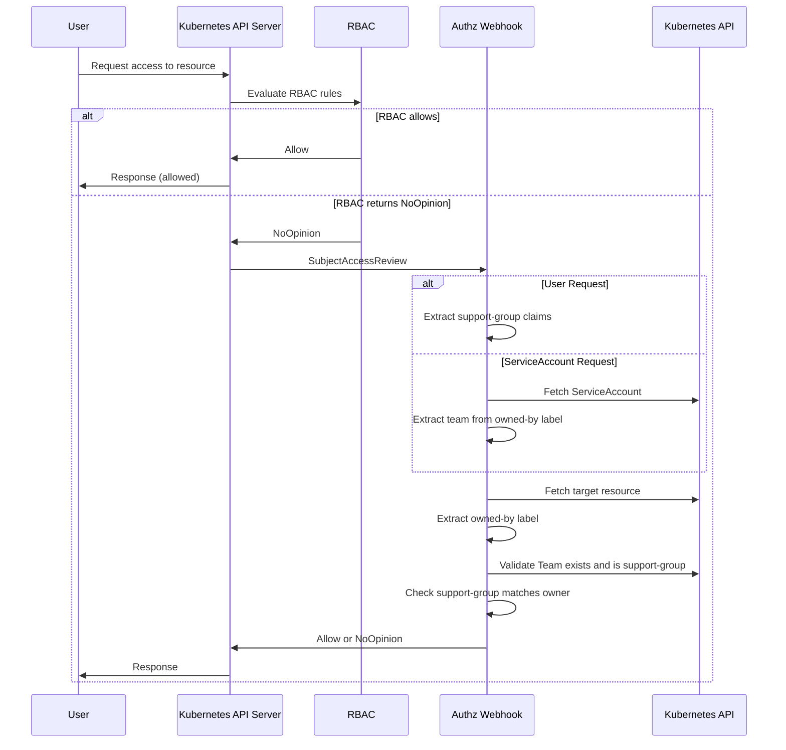

## Overview

The Greenhouse Authorization Webhook enforces fine-grained access control on Greenhouse resources based on Team ownership. The webhook checks if a user's **support-group claims** match the **`greenhouse.sap/owned-by` label** on resources before granting access.

This enables Teams to have **elevated permissions on resources they own**, while maintaining visibility across the Organization.

## Why This Exists

Greenhouse uses a **single namespace per Organization** for all resources. While this simplifies management, it requires a mechanism to allow Teams to manage their own resources without unrestricted access to resources owned by other Teams.

The authorization model combines two layers:

| Layer | Purpose |
|-------|---------|
| **RBAC** | Provides organization-wide permissions (e.g., view all resources, admin roles) |
| **Authorization Webhook** | Grants elevated permissions on resources owned by the requesting Team |

This allows:
- **All Teams** to view resources across their Organization (via RBAC)
- **Resource owners** to get, update, patch, and delete their own existing resources (via the webhook)
- **Organization admins** to manage resources organization-wide via RBAC roles (including create and collection operations)

## How It Works

The authorization webhook integrates with the Kubernetes API server's authorization chain as an additional authorizer **after RBAC**. When a user attempts to access a Greenhouse resource:

1. **RBAC is evaluated first** — If RBAC allows the request, it is granted immediately
2. **If RBAC returns NoOpinion** (no matching rule), the webhook is consulted for `greenhouse.sap` resources
3. The webhook extracts the user's **support-group claims** from their IdP token groups
4. It fetches the target resource and reads its **`greenhouse.sap/owned-by` label**
5. It validates that the referenced Team exists and is marked as a **support-group**
6. Access is **allowed** only if one of the user's support-groups matches the resource owner

If no authorizer in the chain allows the request, it is denied by default. Note that the webhook can only authorize requests targeting a **specific named resource** — collection operations (list, watch) must be granted via RBAC.



> **Note**: The webhook only handles resources in the `greenhouse.sap` API group. Core Kubernetes resources (Secrets, ConfigMaps, etc.) are authorized by RBAC only.

## Identity Resolution

The webhook supports two types of identities:

### User Requests

For human users, the webhook extracts support-group claims from the user's group memberships. Groups with the prefix `support-group:` are recognized as support-group claims.

**Example**: A user with groups `["support-group:my-team", "developers"]` would have `my-team` as their support-group.

Users can belong to multiple support-groups. Access is granted if **any** of their support-groups matches the resource owner.

### ServiceAccount Requests (Team Automation)

ServiceAccounts enable Teams to set up automation that has the same elevated permissions on their owned resources as human team members. This is useful for CI/CD pipelines, custom controllers, or scheduled jobs that need to deploy or manage resources on behalf of a Team.

For ServiceAccounts, the webhook:

1. Extracts the ServiceAccount name from the username (format: `system:serviceaccount:{namespace}:{name}`)
2. Fetches the ServiceAccount from the cluster
3. Extracts the team name from the `greenhouse.sap/owned-by` label on the ServiceAccount

The ServiceAccount is then authorized as if it were a member of the owning Team, allowing it to manage resources with the same `owned-by` label.

## Configuring Resource Ownership

To enable authorization via the webhook, you must properly configure ownership on your resources. This section explains how to set up the required labels.

### Step 1: Label Your Resources

Add the `greenhouse.sap/owned-by` label to your Greenhouse resources, setting the value to your Team name:

```yaml
apiVersion: greenhouse.sap/v1alpha1
kind: Plugin
metadata:
  name: my-plugin
  namespace: my-organization
  labels:
    greenhouse.sap/owned-by: my-team  # Your team name
spec:
  # ...
```

Any namespaced resource in the `greenhouse.sap` API group that carries the `greenhouse.sap/owned-by` label can be authorized by the webhook. Common examples include:
- **Plugins** - Application deployments
- **PluginPresets** - Plugin templates
- **Clusters** - Onboarded Kubernetes clusters
- **TeamRoleBindings** - RBAC bindings

### Step 2: Configure Your Team as a Support Group

The Team referenced in the `owned-by` label must be marked as a support-group:

```yaml
apiVersion: greenhouse.sap/v1alpha1
kind: Team
metadata:
  name: my-team
  namespace: my-organization
  labels:
    greenhouse.sap/support-group: "true"  # Required for authorization
spec:
  description: "My operations team"
  mappedIdPGroup: "my-team-idp-group"
```

> **Note**: Only Teams with `greenhouse.sap/support-group: "true"` are recognized by the authorization webhook. See [Support Groups](../../core-concepts/teams#support-groups) for more information.

### Step 3: Configure Your IdP Group Claims

Ensure your identity provider (IdP) includes group claims with the `support-group:` prefix in user tokens:

```
support-group:my-team
```

This maps your IdP group to the Team name used in the `owned-by` label.

### Step 4 (Optional): Use Your Team's ServiceAccount for Automation

When a Team is marked as a support-group, Greenhouse automatically creates a ServiceAccount named `<team-name>-sa` with the `greenhouse.sap/owned-by` label pre-configured. This ServiceAccount can be used for CI/CD pipelines or other automation that needs to manage resources on behalf of the Team.

The ServiceAccount is managed by the Team controller:
- **Created automatically** when a Team gets the `greenhouse.sap/support-group: "true"` label
- **Named** `<team-name>-sa` (e.g., for team `my-team`, the SA is `my-team-sa`)
- **Deleted automatically** if the support-group label is removed from the Team

> **Note**: The ServiceAccount is created as part of the Team reconciliation cycle, which requires `spec.mappedIdPGroup` to be set and the Organization's SCIM integration to be configured and available. If these prerequisites are not met, the ServiceAccount will not be created even if the support-group label is present. See [Setting up Team members synchronization](../../../user-guides/organization/creation#setting-up-team-members-synchronization-with-greenhouse) for SCIM configuration details.

> **Note**: The `greenhouse.sap/owned-by` label on the ServiceAccount is **immutable** once set - it cannot be changed or removed. This prevents cross-team privilege escalation.

## Troubleshooting

### "user has no support-group claims and is not an authorized ServiceAccount"

**Cause**: The user doesn't have any group memberships prefixed with `support-group:`.

**Solution**: Ensure the user's IdP token includes group claims in the format `support-group:{team-name}` matching a valid Team in Greenhouse.

### "resource has no owned-by label"

**Cause**: The target resource doesn't have the `greenhouse.sap/owned-by` label.

**Solution**: Add the label to the resource:
```bash
kubectl label plugin my-plugin greenhouse.sap/owned-by=my-team -n my-organization
```

### "team \<name\> is not a support-group"

**Cause**: The Team referenced in the `owned-by` label exists but isn't marked as a support-group.

**Solution**: Add the support-group label to the Team:
```bash
kubectl label team my-team greenhouse.sap/support-group=true -n my-organization
```

### "support-group does not match resource owner"

**Cause**: The user's support-group claims don't match the `greenhouse.sap/owned-by` label on the resource.

**Solution**: Verify that the user belongs to the correct support-group, or that the resource's `owned-by` label is set to the correct team name.

### "ServiceAccount \<name\> not found"

**Cause**: The ServiceAccount used for automation doesn't exist. Greenhouse automatically creates a ServiceAccount named `<team-name>-sa` for each support-group Team.

**Solution**: Verify that your Team has the `greenhouse.sap/support-group: "true"` label set. The Team controller will automatically create the ServiceAccount. Check that the SA exists:
```bash
kubectl get serviceaccount my-team-sa -n my-organization
```

## Related Documentation

- [Ownership](./../ownership) - Understanding resource ownership in Greenhouse
- [Teams](../../core-concepts/teams) - Team management and support-groups
- [Processes](./../processes) - Operational processes enabled by ownership