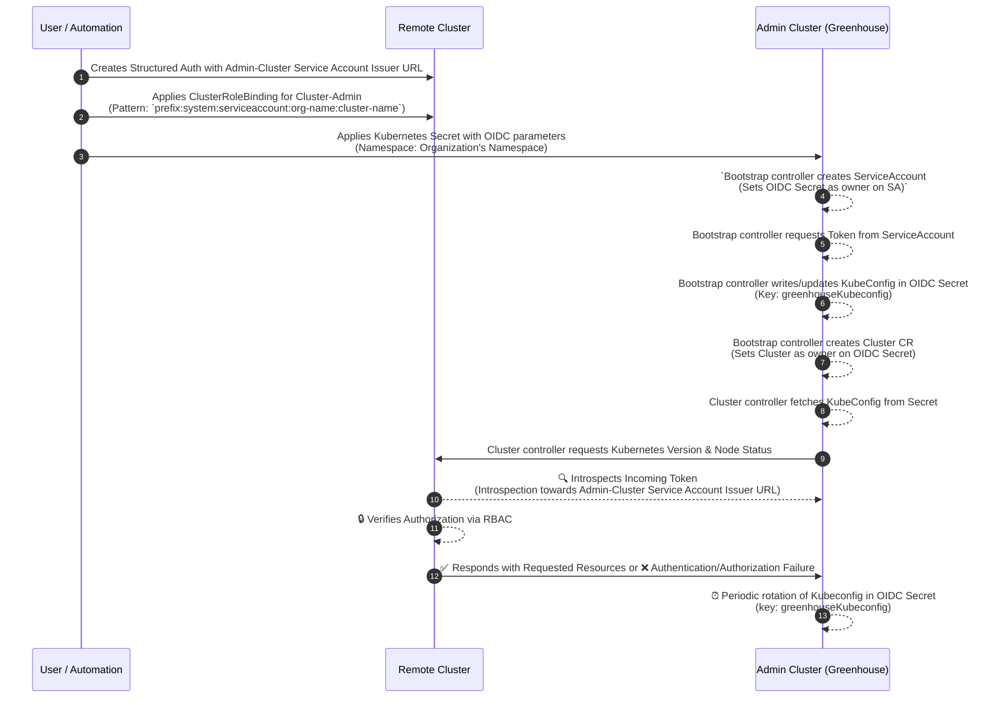

## Content Overview

- [OIDC Overview](#oidc-overview)
- [Preparation](#preparation)
- [Onboard](#onboard)
- [Troubleshooting](#troubleshooting)

This guide describes how to onboard an existing Kubernetes cluster to your Greenhouse Organization with OIDC
configuration.
If you don't have a [Greenhouse Organization](https://cloudoperators.github.io/greenhouse/docs/user-guides/organization/creation/) yet, please reach out to the Greenhouse administrators.

While all members of an Organization can see existing Clusters, their management requires [`org-admin` or
`cluster-admin` privileges](./../../getting-started/core-concepts/organizations).

```
NOTE: The UI is currently in development. For now this guide describes the onboarding workflow via command line.
```

### OIDC Overview

Starting from Kubernetes v1.21, the feature [Service Account Issuer Discovery](https://kubernetes.io/docs/tasks/configure-pod-container/configure-service-account/#service-account-issuer-discovery)
transforms the Kubernetes API server into an OIDC identity provider. This setup facilitates the issuance of tokens, via
service accounts to pods, which are recognizable by external services outside the Kubernetes cluster, thereby
establishing an authentication pathway between the pod within the cluster and external services including those on
Azure, AWS, etc.

Starting from Kubernetes v1.30, [Structured Authentication Configuration](https://kubernetes.io/blog/2024/04/25/structured-authentication-moves-to-beta/)
moved to beta and the feature gate is enabled by default. This feature allows configuring multiple OIDC issuers and
passing them as a configuration file to the Kubernetes API server.


> More information on Structured Authentication Configuration can be found at https://kubernetes.io/docs/reference/access-authn-authz/authentication/#using-authentication-configuration

With the combination of _Service Account Issuer Discovery_ and _Structured Authentication Configuration_, Cluster to
Cluster trust can be established.

A remote cluster can add the `Greenhouse` cluster's _Service Account Issuer_ as an
OIDC issuer in its _Structured Authentication Configuration_. This allows the `Greenhouse` cluster to authenticate
against said remote cluster, using an in-cluster service account token.

The **OIDC Remote Cluster Connectivity** is illustrated below -




### Preparation

The `Greenhouse` cluster should expose the `/.well-known/openid-configuration` over an unauthenticated endpoint to allow
remote clusters to fetch the OIDC configuration.


> Some cloud providers or managed Kubernetes services might not expose the _Service Account Issuer Discovery_ as an unauthenticated endpoint. In such
cases, you can serve this configuration from a different endpoint and set this as the discoveryURL 
in structured authentication configuration. 
> 
> Check out https://kubernetes.io/docs/reference/access-authn-authz/authentication/#using-authentication-configuration
for more information.

Configure the OIDC issuer in the `Structured Authentication Configuration` of the remote cluster.

**Example Structured Authentication Configuration file**

```yaml
apiVersion: apiserver.config.k8s.io/v1beta1
kind: AuthenticationConfiguration
jwt:
  - issuer:
      url: https://<greenhouse-service-account-issuer>
      audiences:
        - greenhouse # audience should be greenhouse
    claimMappings:
      username:
        claim: 'sub' # claim to be used as username
        prefix: 'greenhouse:' # prefix to be added to the username to prevent impersonation (can be any string of your choice)
# additional trusted issuers
#     - issuer:
```

Add RBAC rules to the remote cluster, authorizing `Greenhouse` to manage Kubernetes resources.

```yaml
apiVersion: rbac.authorization.k8s.io/v1
kind: ClusterRoleBinding
metadata:
  name: greenhouse-<cluster-name>-oidc-access
subjects:
  - kind: User
    apiGroup: rbac.authorization.k8s.io
    name: greenhouse:system:serviceaccount:<your-organization-namespace>:<cluster-name>
roleRef:
  apiGroup: rbac.authorization.k8s.io
  kind: ClusterRole
  name: cluster-admin
```

The subject kind `User` name must follow the pattern of
`<prefix>:system:serviceaccount:<your-organization-namespace>:<cluster-name>`.

`<prefix>` is the prefix used in the `Structured Authentication Configuration` file for the `username` claim mapping.

```NOTE
For convenience purposes, the `prefix` is set to `greenhouse:` in the example `Structured Authentication Configuration`
but it can be any string identifier of your choice.

If you use '-' in prefix, for example, `identifier-` then the subject name should be `identifier-system:serviceaccount:<your-organization-namespace>:<cluster-name>`.
```

### Onboard

You can now onboard the remote Cluster to your Greenhouse Organization by applying a Secret in the following format:

```yaml
apiVersion: v1
kind: Secret
metadata:
  annotations:
    "oidc.greenhouse.sap/api-server-url": "https://<remote-cluster-api-server-url>"
  name: <cluster-name> # ensure the name provided here is the same as the <cluster-name> in the ClusterRoleBinding
  namespace: <organization-namespace>
data:
  ca.crt: <double-encoded-ca.crt> # remote cluster CA certificate base64 encoded
type: greenhouse.sap/oidc # secret type
```

Mandatory fields:

- the annotation `oidc.greenhouse.sap/api-server-url` must have a valid URL pointing to the remote cluster's API server
- the `ca.crt` field must contain the remote cluster's CA certificate
- the type of the Secret must be `greenhouse.sap/oidc`
- the name of the secret must equal the `<cluster-name>` used in the `ClusterRoleBinding` Subject

`ca.crt` is the `certificate-authority-data` from the kubeconfig file of the remote cluster.

The `certificate-authority-data` can be extracted from the ConfigMap `kube-root-ca.crt`. This ConfigMap is present in every Namespace.

If the certificate is extracted from `kube-root-ca.crt` then it should be base64 encoded twice before adding it to the
secret.

example:

```shell
$ kubectl get configmap kube-root-ca.crt -n kube-system -o jsonpath='{.data.ca\.crt}' | base64 | base64
```

If the certificate is extracted from the KubeConfig file then the certificate is already base64 encoded, so the
encoding is needed only once.

Apply the Secret to the Organization Namespace to onboard the remote cluster.

```shell
$ kubectl apply -f <oidc-secret-file>.yaml
```

### Troubleshooting

If the bootstrapping failed, you can find details about why it failed in the `Cluster.status.statusConditions`. 
More precisely, there will be conditions of `type=KubeConfigValid`, `type=PermissionsVerified`, `type=ManagedResourcesDeployed`, and `type=Ready`, each of which may provide helpful context in the message field. 
These conditions are also displayed in the UI on the Cluster details view.

If there is any error message regarding RBAC then check the `ClusterRoleBinding` and ensure the subject name is correct

If there is any authentication error then you might see a message similar to
`the server has asked for the client to provide credentials`,
in such cases verify the `Structured Authentication Configuration` and ensure the `issuer` and `audiences` are correct.

The `API Server` logs in the remote cluster will provide more information on the authentication errors.
